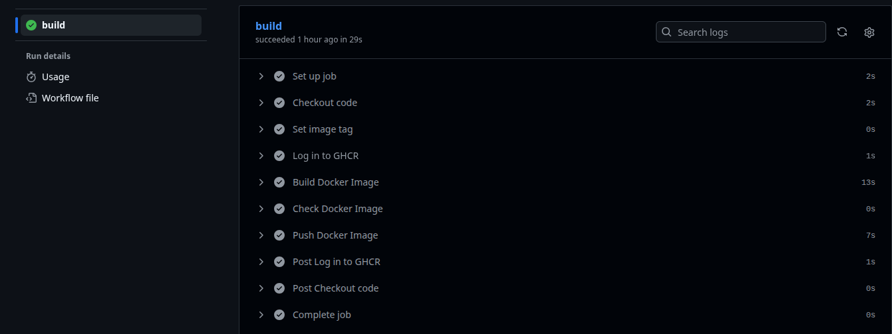
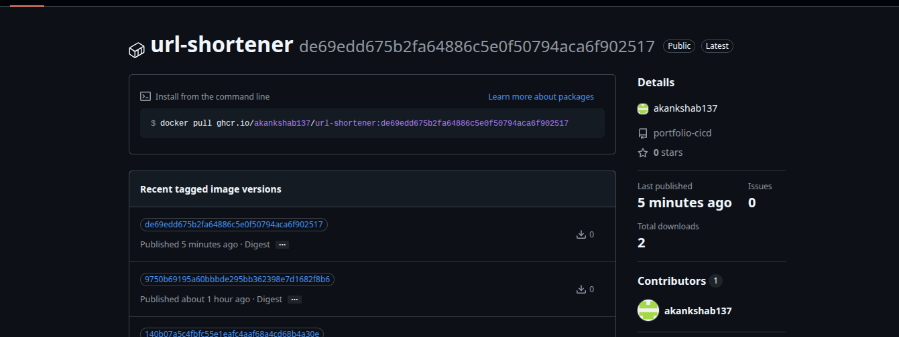
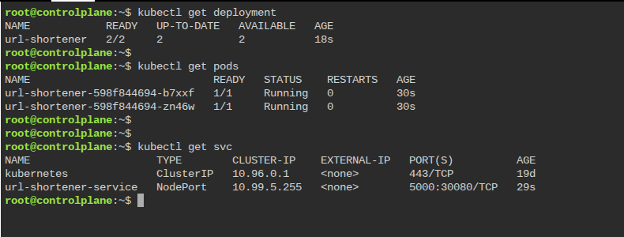

# CI/CD Pipeline for a Containerized Application on Kubernetes

## Overview

This project demonstrates an end-to-end DevOps workflow for a containerized Flask application, covering application containerization, automated CI using GitHub Actions, container image publishing to GitHub Container Registry (GHCR), and Kubernetes deployment.

The project was built to understand and demonstrate how application code moves from source control to a container registry and ultimately into a Kubernetes environment.

## Architecture

```text
                    Developer
                        |
                        | git push
                        v
                    GitHub
                        |
                        v
               GitHub Actions
                        |
              +---------+---------+
              |                   |
              v                   v
             CI                  CD
              |                   |
      +-------+-------+       Kubernetes
      |       |       |           |
    Test    Build   Push          |
              |       |           v
              |       +------> GHCR
              |                   |
              +-------------------+
                                  |
                                  v
                         Kubernetes Deployment
                                  |
                         +--------+--------+
                         |                 |
                         v                 v
                       Pod 1             Pod 2
                         |                 |
                         +--------+--------+
                                  |
                                  v
                            Flask Application
                                  |
                                  v
                              Kubernetes
                               Service
```

## Technologies Used

* **Python / Flask** — application
* **Gunicorn** — production WSGI server
* **Docker** — application containerization
* **GitHub Actions** — CI automation
* **GitHub Container Registry (GHCR)** — container image registry
* **Kubernetes** — application orchestration
* **kubectl** — Kubernetes management
* **Git** — source control
* **Killercoda** — Kubernetes development and testing environment

## Application

The application is a simple URL shortener implemented using Flask.

The application is packaged into a Docker image and served using Gunicorn rather than Flask's development server.

The container listens on port `5000`.

## CI Pipeline

The CI workflow is triggered whenever changes are pushed to the `main` branch.

The pipeline performs the following steps:

1. Checks out the source code.
2. Generates a unique Docker image tag using the Git commit SHA.
3. Authenticates to GitHub Container Registry using the GitHub Actions token.
4. Builds the Docker image.
5. Verifies the generated image.
6. Pushes the image to GHCR.

### Image Versioning

Instead of manually maintaining image versions such as `v1`, `v2`, and `v3`, the pipeline uses the Git commit SHA as the image tag.

For example:

```text
ghcr.io/akankshab137/url-shortener:<commit-sha>
```

This provides a unique relationship between a Docker image and the exact source-code revision that produced it.

This also makes the image suitable for automated deployment, because a deployment can reference a specific immutable application version.

## Kubernetes Deployment

The application is deployed to Kubernetes using a `Deployment` and a `Service`.

### Deployment

The Kubernetes Deployment:

* Runs two replicas of the application.
* Uses the container image stored in GHCR.
* Exposes container port `5000`.
* Configures the application's `BASE_URL` environment variable.
* Allows Kubernetes to manage the lifecycle and rollout of application Pods.

### Service

A Kubernetes `NodePort` Service exposes the application outside the Kubernetes cluster.

The relevant ports are:

```text
NodePort:     30080
Service port: 5000
Target port:  5000
```

The Service selects Pods using the `app: url-shortener` label.

## CD Design

The intended CD flow is:

```text
New application code
        |
        v
GitHub Actions
        |
        v
Build image using commit SHA
        |
        v
Push image to GHCR
        |
        v
Update Kubernetes Deployment
        |
        v
Kubernetes performs rolling update
        |
        v
New application Pods running
```

In a production-accessible Kubernetes environment, the deployment stage could update the image referenced by the Deployment using `kubectl`, for example:

```bash
kubectl set image deployment/url-shortener \
  url-shortener=ghcr.io/akankshab137/url-shortener:<commit-sha>

kubectl rollout status deployment/url-shortener
```

The Kubernetes Deployment would then create new Pods using the updated image and gradually replace the previous Pods.

### Current CD Limitation

The Kubernetes deployment was developed and validated using Killercoda.

The Killercoda Kubernetes API server is exposed through an internal/private cluster address. Because GitHub-hosted Actions runners run outside the Killercoda environment, they cannot directly reach the Kubernetes API server.

Therefore, the GitHub Actions workflow currently implements the CI portion and the Kubernetes deployment has been independently validated in Killercoda. The CD deployment mechanism and required Kubernetes interaction have been designed and documented, but automated GitHub Actions → Killercoda deployment is not enabled.

A production implementation would use a Kubernetes cluster with an API endpoint reachable by the CI/CD runner and securely configured Kubernetes credentials.

## Project Structure

```text
portfolio-cicd/
├── app/
│   ├── app.py
│   ├── requirements.txt
│   └── README.md
├── k8s/
│   ├── deployment.yaml
│   └── service.yaml
├── .github/
│   └── workflows/
│       └── ci-cd.yml
├── Dockerfile
├── .dockerignore
├── .gitignore
└── README.md
```

## Running the Application Locally

Build the Docker image:

```bash
docker build -t url-shortener .
```

Run the container:

```bash
docker run -p 5000:5000 url-shortener
```

The application can then be tested using:

```bash
curl -X POST http://localhost:5000/shorten \
  -H "Content-Type: application/json" \
  -d '{"url":"https://www.google.com"}'
```

## Kubernetes Deployment

The Kubernetes manifests can be applied using:

```bash
kubectl apply -f k8s/deployment.yaml
kubectl apply -f k8s/service.yaml
```

Verify the deployment:

```bash
kubectl get deployments
kubectl get pods
kubectl get services
```

Check the rollout:

```bash
kubectl rollout status deployment/url-shortener
```

## Pipeline Evidence

### GitHub Actions CI

The GitHub Actions workflow automatically builds the Docker image and publishes it to GHCR using a unique Git commit SHA as the image tag.



### GitHub Container Registry

The generated Docker image is published to GitHub Container Registry and can be referenced by its commit-specific tag.



### Kubernetes Deployment

The application was deployed and validated on a Kubernetes cluster using two replicas and a NodePort Service.



## Key DevOps Concepts Demonstrated

* Git-based source control
* CI automation using GitHub Actions
* Docker image creation and publishing
* Container image versioning using Git commit SHA
* GitHub Container Registry authentication
* Kubernetes Deployments and replicas
* Kubernetes Services and NodePort networking
* Environment variables in Kubernetes
* Kubernetes rolling updates
* CI/CD architecture and deployment flow
* Understanding the networking and authentication requirements between a CI runner and a Kubernetes API server

## Future Improvements

Potential extensions to the project include:

* Automated deployment to a remotely accessible Kubernetes cluster
* Kubernetes authentication using securely managed CI/CD credentials
* Helm-based Kubernetes packaging
* GitOps-based deployment using Argo CD
* Automated application testing in the CI pipeline
* Monitoring and observability using Prometheus and Grafana
